<h1 align="center">Hi 👋 I'm Ahmad Zaeladi</h1>

<!-- Animasi Teks Berjalan -->

  

  🌍 Based in Indonesia | 🎓 6th-Semester Student at Pamulang University 

---

<h3 align="center">🛠️ Tech Stack & Tools</h3>

<!-- Ikon Skill -->

  

  <i>Core Stack: Node.js, Express, PostgreSQL, CodeIgniter 4, and Bootstrap 5</i> 
  <i>Backend & API: Node.js, Express.js, CodeIgniter 4, Swagger</i> 
  <i>Frontend: HTML/CSS, Bootstrap 5, Modern UI/UX Prototyping</i>

  

